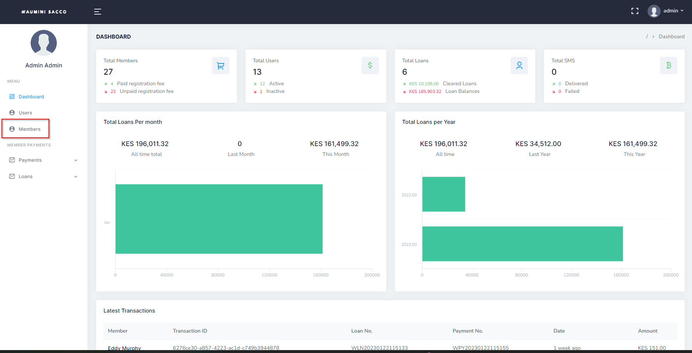

# Sacco Members
>How to add a member

- Log in to the system, _Refer to **[Logging in](logging.md)** section_
- Once you are logged in, navigate to the "Members" section of the main navigation menu.

- In the Members section, click on the "Add Member" button.

!> Member Identification Numbers are automatically generated by the system

- Fill in the required information for the new member, such as name, email, phone number, ID/Passport number, etc.

- Click on the "Submit" button to create the new member.

- Repeat the process to create additional members as needed.
- To edit or delete an existing Member, navigate to the "Members", find the user within that table or you can search that user click on the "Edit" button. The you will see the "Delete" within the edit page

!> It is also important to ensure that the created members are given the appropriate roles and permissions, to ensure the security and integrity of the system.

