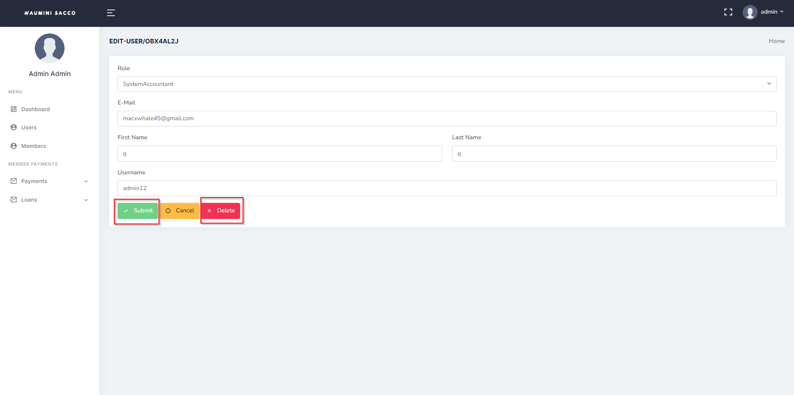

# System Users
>How add users
- Log in to the system. _Refer to **[Logging In](logging.md)** section_
- Once you are logged in, navigate to the "Users" section of the main navigation menu.

- In the Users section, click on the "Add User" button.

- Fill in the required information such as name and emailvfor the new user. You may also be required to assign roles, such as administrator or regular user, to the new user.

- Click on the "Submit" button to create the new user.

- Repeat the process to create additional users as needed.
- To edit or delete an existing user, navigate to the "Users", find the user within that table or you can search that user  click on the "Edit" button. The you will see the  "Delete" within the edit page.

!> It is also important to ensure that the created users are given the appropriate roles and permissions, to ensure the security and integrity of the system.
