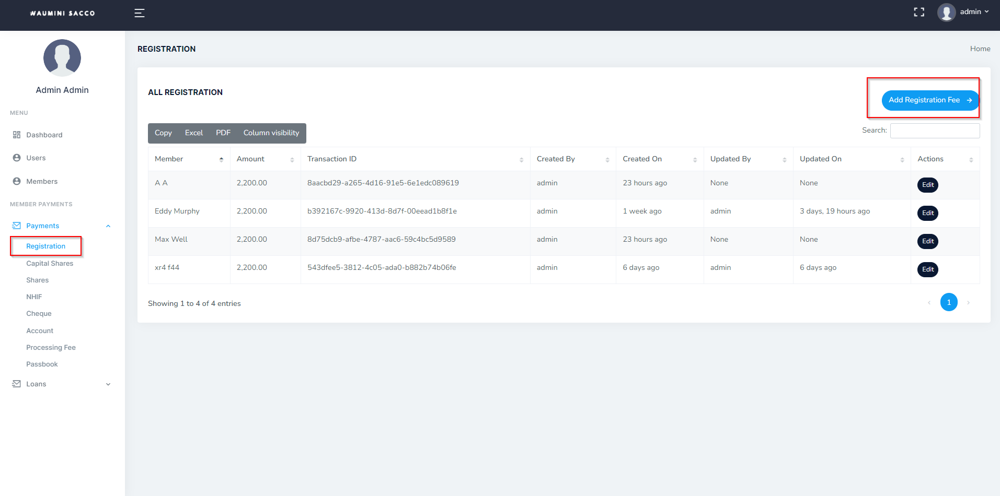

# Payments
> How do add different payments from Sacco Members

- Log in to the system, _Refer to **[Logging in](logging.md)** section_
- Once you are logged in, navigate to the "Payments" section of the main navigation menu.

- In the Payments section, there are various types of payments. This payments include:
1. Registration.
2. Capital Shares.
3. Shares.
4. NHIF.
5. Cheques.
6. Account.
7. Processing Fee.
8. Passbook

- Click on one of the above, an "Add" button with the name of the Payment module.

- Select the member that is making the payment from the drop-down list or search for the member by name.

- Enter the amount of the payment..

!> It is important to ensure that the payments are recorded accurately, to ensure the accurate balance of the member accounts and loans, and proper accounting.

- Click on the "Save" button to save the payment.
- Repeat the process to record additional payments as needed.
- To view or edit a recorded payment, navigate to the "Payments" section, choose the module e.g NHIF and click on the "View" or "Edit" button next to the corresponding payment.

!> Please note that we capture date time and the user adding or editing records to ensure data integrity.
